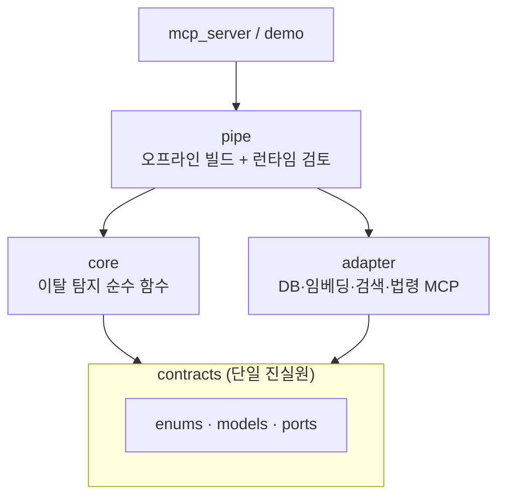
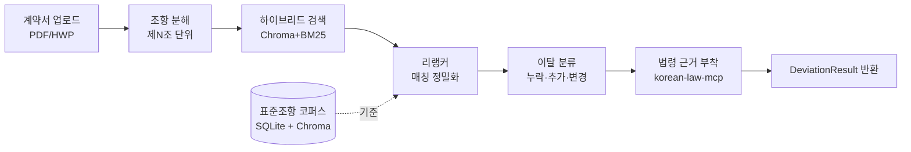

# WorkShield 🛡️

> **프리랜서 용역계약서를 표준계약서와 조항 단위로 비교해 "표준 대비 이탈"을 탐지하는 RAG MCP 시스템**

내가 받은 계약서가 정부·공공기관 **표준계약서** 대비 **어디가 빠졌고(누락) / 더 들어갔고(추가) / 다르게 쓰였는지(변경)** 를 찾아주고, 관련 **법령 조문**까지 근거로 붙여줍니다.

## 핵심 명제

**"올바른 법 해석을 생성"하지 않는다. "표준 대비 이탈을 탐지"한다.**

법 해석을 AI가 지어내면 정답 기준이 무너지고 책임 문제가 생깁니다. 그래서 **표준계약서를 정답(기준)으로 고정**하고, 사용자 조항이 그 기준에서 벗어난 지점을 검색으로 찾습니다. "벗어남"은 검증·측정이 가능한 문제입니다.

- **1차 MVP (현재):** LLM 없이 **검색·비교·규칙**만으로 이탈 탐지 → MCP 도구로 제공. LLM 없이 정량 평가(Recall@k·MRR·ablation).
- **2차 (예정):** 1차 MCP를 LLM에 붙인 웹앱 — "불리함" 해석·협상 초안 생성.

> 자세한 기획은 [docs/01.mvp_기획.md](docs/01.mvp_기획.md) 참고.

---

## 빠른 시작

### 사전 준비물
- [uv](https://docs.astral.sh/uv/) (Python 패키지 매니저), Python 3.13
- Node.js (없으면 `just setup`이 자동 설치 시도)
- 법제처 API 인증키 `OPEN_LAW_API_KEY` ([open.law.go.kr](https://open.law.go.kr) 발급) — `just setup` 중 입력 안내

### 설치 & 빌드
```bash
uv tool install rust-just     # just 명령 러너 설치 (최초 1회)
just setup                    # node·MCP패키지·uv동기화·모델다운로드·DB마이그레이션 일괄
just build-db                 # 03_normalized(정답) → SQLite → Chroma 인덱스 재생성
uv run pytest                 # 테스트 (현재 통과/스킵 규격 확인)
```

### 주요 명령
| 명령 | 설명 |
| --- | --- |
| `just setup` | 최초 1회 개발 환경 전체 구축 |
| `just build-db` | DB + 벡터 인덱스 **원클릭 재생성** (migrate → build-index) |
| `just migrate` | 03_normalized JSON → SQLite 적재까지 |
| `just normalize` | 02_converted 마크다운 → 03_normalized JSON |
| `just build-index` | SQLite → bge-m3 임베딩 → Chroma 인덱스 |
| `just parse <file>` | HWP/PDF → 마크다운 변환 (kordoc) |
| `just law` | korean-law-mcp 명령어 실행 |
| `uv run pytest` | 전체 테스트 |

---

## 아키텍처

**헥사고날(포트-어댑터) 구조 — 코어는 외부를 모른다.** 동결된 계약(`contracts`)에만 의존해 여러 명이 병렬로 개발합니다.



### 런타임 검토 흐름 (review_contract)


> 모듈별 상세는 각 폴더 README: [contracts](src/contracts/README.md) · [core](src/core/README.md) · [adapter](src/adapter/README.md) · [pipe](src/pipe/README.md)

---

## 기술 스택

| 영역 | 사용 도구 |
| --- | --- |
| 임베딩 / 리랭커 | `BAAI/bge-m3` · `BAAI/bge-reranker-v2-m3` |
| 벡터 검색 | Chroma (dense) + `rank_bm25` + Kiwi 형태소 (sparse) + RRF 융합 |
| 조항 분해(청킹) | LlamaIndex `MarkdownNodeParser` |
| 저장소 | SQLite (조항·관계·독소패턴) |
| 법령 근거 | korean-law-mcp (외부 MCP) |
| 문서 변환 | kordoc (HWP/PDF → 마크다운) |
| 인터페이스 | MCP (`mcp[cli]` / FastMCP) |
| 검증 · 도구 | pydantic · uv · just · pytest |

---

## 프로젝트 구조

```
.
├── data/
│   ├── 01_raw/          # 원본 표준계약서 (HWP)            [커밋]
│   ├── 02_converted/    # 마크다운 변환 (체크포인트)        [커밋]
│   ├── 03_normalized/   # 정규화 조항 JSON = 정답           [커밋]
│   └── migration/       # 스키마 SQL[커밋] + SQLite·Chroma[생성물·미커밋]
├── src/
│   ├── contracts/       # 동결 계약 (enums · models · ports)
│   ├── core/            # 이탈 탐지 순수 함수 (TDD 대상)
│   ├── adapter/         # 외부 I/O (db · vector · embedder · 법령·문서 MCP)
│   ├── pipe/            # 파이프라인 (오프라인 빌드 + 런타임 review)
│   └── config.py
├── eval/                # 평가 하니스 (metrics · run_eval · ablation)
├── tests/               # pytest (TDD 규격서)
├── docs/                # 기획서 + 작업 분배 카드(tasks/)
├── AGENTS.md            # AI·개발자 공용 가이드 (절대 규칙)
└── justfile             # 명령 모음
```

---

## 데이터 & 형상관리

> **정답은 git, 인덱스는 재생성.**

- **git 관리:** `data/03_normalized/*.json`(정답) · `data/migration/*.sql`(스키마) · `02_converted/*.md`
- **git 제외(재생성물):** `*.sqlite3` · Chroma 인덱스 → 바이너리를 주고받지 않고 `just build-db`로 누구나 동일 DB를 만듭니다.

자세히는 [data/README.md](data/README.md).

---

## 개발 가이드 (TDD)

규격은 `tests/`의 테스트로 고정돼 있습니다. **테스트를 먼저 읽고 통과하도록 구현**합니다.

```bash
uv run pytest -ra        # 남은 규격(skip) 목록 확인
uv run pytest -q         # 통과/스킵 요약
```

- 작업 시작 전 **[AGENTS.md](AGENTS.md)** 의 절대 규칙과 본인 모듈 폴더 README를 읽으세요.
- 모듈별 작업 카드: **[docs/tasks/](docs/tasks/README.md)**

### 절대 규칙 (요약)
1. **1차 코드에 LLM 호출 금지** — 검색·매칭·분류만 (해석은 2차).
2. **동결 계약이 단일 진실원** — 스키마·MCP 시그니처 변경은 사전 합의.
3. 사용자 표면 문구는 **"검토 후보"** 프레이밍 ("위법/합법" 단정 금지).
4. **빈 응답 금지** — 매칭 없음은 `NO_MATCH` 등 명시 표식.
5. **평가에 LLM-judge 금지** — 결정론적·재현 가능한 계산만.

---

## 라이선스 / 출처
- 표준계약서: 소프트웨어산업협회(sw.or.kr) · 문화체육관광부(mcst.go.kr)
- korean-law-mcp · kordoc (MIT) / bge 모델 (BAAI) / Chroma (Apache-2.0)
