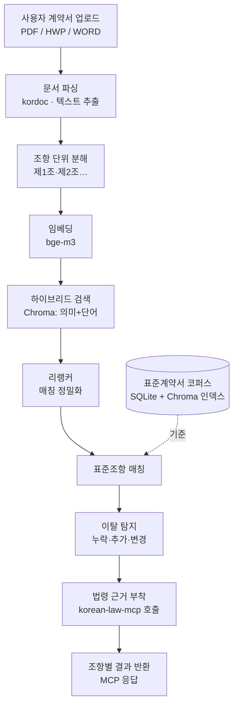

# WorkShield — 1차 MVP 기획서
### 프리랜서 용역계약 "표준 대비 검토" RAG 시스템

> **이 문서를 읽기 전에**
> 개발 용어가 처음 나올 때는 괄호로 짧은 설명을 붙였고, 문서 맨 끝 **[부록 A. 용어집]** 에 핵심 용어를 모아 풀어 두었습니다. 표가 많은 3·4·9장은 팀 전체가 같은 그림을 보기 위한 "약속"이므로, 작업 시작 전에 함께 확정합니다.

---

## 1. 개요 & 스코프

### 1.1 한 줄 정의
사용자가 올린 **프리랜서 용역계약서**를 정부·공공기관이 배포한 **표준 용역계약서**와 조항 단위로 비교해, 내 계약서가 표준에서 **어디가 빠졌고 / 더 들어갔고 / 다르게 쓰였는지**를 찾아 주고, 관련 법 조문까지 함께 보여 주는 시스템.

### 1.2 배경
프리랜서·긱워커(개발자·디자이너·크리에이터 등 건별로 일하는 노동자)는 계약 형태가 제각각이라, 표준 근로계약만으로는 보호받기 어려운 사각지대가 많습니다. 특히 저작권·2차 가공 권리, 과업 범위, 대금 지급 같은 조항은 변호사 자문이 필요한데 비용 장벽이 높습니다. 기존 서비스는 정책을 나열하거나 단순 위반 여부만 알려 주는 수준에 머뭅니다.

### 1.3 핵심 명제 (Thesis)
**"올바른 법 해석을 생성"하지 않는다. "표준 대비 이탈을 탐지"한다.**
- "이 조항이 법적으로 어떻다"를 AI가 지어내게 두면 정답의 기준이 무한해지고 책임 문제가 생깁니다.
- 대신 **표준계약서를 정답(기준)으로 고정**하고, 사용자 조항이 그 기준에서 벗어난 지점을 검색으로 찾습니다. "벗어남"은 검증·측정이 가능한 문제입니다.

### 1.4 1차 / 2차 경계
| 구분 | 1차 (본 문서, 1주) | 2차 (별도 1주) |
| --- | --- | --- |
| 산출물 | 표준 대비 이탈 탐지 **RAG를 MCP 도구로 제공** | 1차 MCP를 LLM에 붙인 **웹앱** |
| AI 생성 | **없음** (검색·비교·규칙만) | LLM이 "불리함" 해석·초안 생성 |
| 평가 | LLM 없이 정량 측정 | 사용성·품질 |

- **RAG**: 질문에 답하기 전에 실제 문서를 먼저 찾아와 그 문서에 근거해 결과를 내는 방식.
- **MCP**: AI 비서나 다른 프로그램이 우리 기능을 "도구"처럼 불러 쓸 수 있게 하는 표준 연결 규격.

### 1.5 명시적 비목표 (Non-Goals) — 하지 않는 것
1. **법률 자문·판단 생성 안 함.** 결과는 "검토가 필요한 **후보**"를 짚어 줄 뿐, "합법/불법"이나 "소송에서 이긴다" 같은 단정을 내리지 않습니다.
2. **1차에서는 LLM(생성 AI)을 쓰지 않습니다.** "불리한지"의 해석은 2차로 미룹니다.
3. **스코프 밖 데이터 제외**: 청년정책 추천, 공정위 표준하도급계약서(하도급은 프리랜서와 법적 성격이 다름), 저작권위 연구보고서는 1차에서 제외.
4. **스캔(사진) 계약서 제외**: 1차는 글자를 추출할 수 있는 PDF/HWP/WORD만. 사진 형태는 2차.

---

## 2. 시스템 아키텍처

### 2.1 전체 흐름

> 쉽게 말해: 내 계약서를 조항으로 잘라 → 표준계약서에서 가장 비슷한 조항을 찾아 → 둘을 비교해 차이를 분류하고 → 관련 법 조문을 붙여 돌려줍니다.

### 2.2 직접 만드는 것 vs 가져다 쓰는 것 (Build vs Buy)
포트폴리오의 차별점은 **우리가 직접 만드는 부분**에 있고, 성숙한 오픈소스는 조합합니다.

| 구분 | 항목                                                                          |
| --- |-----------------------------------------------------------------------------|
| **직접 구축 (우리 코어)** | 표준조항 데이터 스키마, 조항 매칭·이탈 탐지 로직, 평가 하니스, 이를 감싼 MCP 도구                          |
| **조합 (검증된 오픈소스)** | 법령 조회·인용검증(korean-law-mcp), 문서변환 변환(kordoc), 임베딩 모델(bge-m3), 벡터 저장소(Chroma) |

> 빌려온 법령 검색이 결과 화면의 "근거"를 채워 주지만, **우리의 기여는 "표준 대비 이탈 탐지"** 라는 점이 드러나도록 설계합니다.

### 2.3 배포 구성
- 우리 MCP 서버(Python)와 self-host한 korean-law-mcp 를 **GCP Cloud Run**(요청이 올 때만 켜지는 서버리스 실행 환경)에 올립니다.
- 벡터 저장소(Chroma)와 조항 레코드(SQLite)는 **별도 서버 없이 파일로** 프로세스 안에 내장 → 운영 단순화.

---

## ★3. 데이터 계약 — 스키마 (Day 0 동결)

> 이 장과 4장은 **작업 시작 전에 반드시 확정**합니다. 여러 명이 여기에 의존해 병렬로 일하기 때문에, 나중에 바뀌면 전부 다시 해야 합니다.

### 3.1 표준조항 정규화 스키마
표준계약서를 조항 단위로 쪼개 아래 형태로 저장합니다(저장소: SQLite).

| 필드 | 의미 | 예시 |
| --- | --- | --- |
| `clause_id` | 조항 고유 식별자 | `sw_std-art12` |
| `contract_type` | 표준계약 종류 (아래 enum) | `SW_FREELANCE` |
| `category` | 조항 분류 (아래 enum) | `IP_OWNERSHIP` |
| `title` | 조항 제목 | 저작권의 귀속 |
| `text` | 조항 본문 (개요 표의 경우 마크다운 테이블 포맷이나 키-값 텍스트로 치환하여 적재) | … |
| `source` | 출처 좌표(파일·조번호) | `sw표준계약서.hwp / 제12조` |
| `version` | 표준계약서 판/개정 버전 | `2024` |

### 3.2 이탈(Deviation) 분류 체계
| 코드 | 이름 | 정의 |
| --- | --- | --- |
| `MISSING` | 누락 | 표준에는 있는데 사용자 계약서에서 대응 조항을 못 찾음 |
| `EXTRA` | 추가 | 사용자 조항이 어떤 표준 조항과도 충분히 매칭되지 않음(비표준 조항) |
| `CHANGED` | 변경 | 표준 조항과 매칭됐지만 본문 차이가 큼 |

### 3.3 확장용 enum (지금 1종이지만, 추가는 "설정만"으로)
- **`contract_type`**: `SW_FREELANCE`(SW 프리랜서), `ARTS_SERVICE`(문화예술용역) … *(향후 `NDA`, `STOCK_OPTION` 추가 슬롯)*
- **`category`** (프리랜서 용역 중심): `PAYMENT`(대금지급), `IP_OWNERSHIP`(저작권 귀속), `DERIVATIVE_WORK`(2차적저작물), `SCOPE_SOW`(과업범위), `TERMINATION`(해지), `CONFIDENTIALITY`(비밀유지), `LIABILITY`(손해배상), `DISPUTE`(분쟁해결)

> **확장성 핵심**: 새 계약 종류를 추가할 때 **코드를 다시 짜지 않고**, 표준계약서 1개 + `contract_type` 값 하나 + 카테고리 매핑만 추가하면 되도록 설계합니다.

---

## ★4. MCP 도구 계약 — 시그니처 (Day 0 동결)

모든 도구는 **stateless**(한 번의 호출이 그 자체로 완결되며, 서버가 이전 상태를 기억하지 않음)로 설계합니다.

| 도구 | 목적 | 입력 | 출력(요약) |
| --- | --- | --- | --- |
| `parse_contract` | 계약서 파일을 조항 목록으로 분해 | 파일(PDF/HWP) | `[{idx, 조번호, title, text}]` |
| `match_clause` | 한 조항에 가장 가까운 표준조항 후보 검색 | `clause_text`, `contract_type` | `[{clause_id, score, standard_text}]` |
| `review_contract` | 전체 검토(매칭→이탈분류→근거부착) | 파일 또는 조항목록, `contract_type` | 아래 4.1 |
| `get_grounding` | 카테고리/조항에 맞는 법령 조문 조회 | `category` 또는 `clause_text` | `[{법령명, 조번호, 본문, 출처}]` (korean-law-mcp 경유) |

### 4.1 `review_contract` 출력 스키마 (조항별)
```json
{
  "user_clause": "사용자 조항 본문",
  "matched_standard": { "clause_id": "...", "title": "...", "text": "..." },
  "deviation": "MISSING | EXTRA | CHANGED | NONE",
  "confidence": 0.0,
  "grounding": [ { "법령명": "저작권법", "조번호": "제5조", "본문": "...", "출처": "..." } ]
}
```

### 4.2 실패·없음 규약
- 매칭 실패 시 빈 값이 아니라 **명시적 표식**(`deviation: "NO_MATCH"` 등)을 반환합니다.
- 이유: 2차에서 LLM이 "조용한 빈 응답"을 보고 없는 내용을 지어내는 것을 막기 위함. (korean-law-mcp가 `[NOT_FOUND]` 표식을 쓰는 방식과 동일한 원칙)

---

## 5. 코퍼스 명세 & 소싱

### 5.1 기준(정답) 데이터 — 표준계약서 2종
| 종류 | 출처 | 대상 |
| --- | --- | --- |
| SW 프리랜서 표준계약서 | 소프트웨어산업협회(sw.or.kr) | 개발자 |
| 문화예술용역 표준계약서 | 문화체육관광부(mcst.go.kr) | 크리에이터·디자이너 |

### 5.2 보조 — 법령
- 저작권법 등 조문은 **자체 수집하지 않고** korean-law-mcp 로 실시간 조회.

### 5.3 제외 (1차)
- 공정위 표준하도급계약서(법적 성격 상이), 저작권위 연구보고서(정답이 아님·장문 노이즈), 저작권법 직접 수집(중복).

### 5.4 정규화 절차
1. 문서 → 텍스트 변환(kordoc, **한 번만 오프라인**으로).
2. 조(條) 단위로 분해.
3. 각 조항에 `category` 라벨 부여.
4. 3장 스키마에 맞춰 SQLite에 적재 → 임베딩 → Chroma 인덱스 생성.

### 5.5 형상관리(버전 관리) 원칙
- **정답의 원천 = 정규화된 조항 데이터(SQLite/JSON)** 를 git으로 관리.
- 벡터 인덱스는 거기서 **다시 생성 가능한 파생물**로 취급(코퍼스가 작아 재생성이 빠름). 바이너리 인덱스를 직접 버전관리하지 않습니다.

---

## 6. 파싱 · 청킹 · 임베딩

- **청킹(긴 문서를 검색 단위로 쪼개는 것)**: 계약서는 "제N조"라는 명확한 구조가 있으므로 **조 단위로 분할**하고, 항·호 구조를 보존합니다.
- **기준 코퍼스**: 오프라인에서 한 번 변환·청킹 → 런타임에 HWP 파싱 부담 0.
- **사용자 업로드**: 텍스트 추출 가능한 문서를 런타임에 파싱(스캔 제외).
- **임베딩(텍스트를 의미가 담긴 숫자 벡터로 바꾸는 것)**: **bge-m3** 사용.
  - bge-m3는 한 모델에서 **의미 기반(dense)** 과 **단어 기반(sparse)** 표현을 모두 뽑습니다.
  - 법률 문서는 "제○조", 정확한 법률 용어 같은 **정확한 단어 일치**가 중요하므로, 단어 기반 표현이 의미 기반을 보완합니다.

---

## 7. 핵심 로직 — 표준 대비 이탈 탐지

| 단계 | 내용 |
| --- | --- |
| 1) 검색 | 사용자 조항마다 **하이브리드 검색**(의미+단어를 함께 쓰는 검색, Chroma)으로 표준조항 후보 top-k 추출 |
| 2) 정밀화 | **리랭커**(후보들의 순위를 다시 매겨 가장 잘 맞는 것을 고르는 모델, bge-reranker-v2-m3)로 최적 매칭 결정 |
| 3) 분류 | 매칭 결과로 이탈 분류 — 표준에 있고 매칭 없음→`MISSING` / 매칭 점수 낮음→`EXTRA` / 매칭됐지만 본문 차이 큼→`CHANGED` |
| 4) 근거 | 각 플래그의 `category`로 korean-law-mcp 호출 → 관련 법령 조문 부착 |
| 5) 출력 | 조항별 [플래그 + 매칭된 표준조항 + 법령 근거 + 신뢰도 점수] |

> **책임 경계**: 이 결과는 "검토가 필요한 후보"를 짚는 것입니다. 1차에는 LLM이 없으므로 해석·판단 문장을 생성하지 않습니다.

### 7.1 고도화 A — 계약-조항 의존성 그래프 (신규성)
계약서는 조항이 서로 얽힌 하나의 시스템입니다. 한 조항이 표준에서 벗어나면 연결된 다른 조항도 함께 위험해집니다. 평면적 검색은 조항을 따로따로 보지만, 의존성 그래프는 **"이 조항이 이탈하면 함께 검토해야 할 조항"** 으로 연결을 따라갑니다.
- **노드** = 조항 분류(3.3의 `category`)와 매칭된 표준조항.
- **엣지** = 조항 간 연관(예: `IP_OWNERSHIP`(저작권 귀속) 이탈 → `DERIVATIVE_WORK`(2차적저작물)·`LIABILITY`(손해배상)도 함께 검토).
- **구현**: 별도 그래프 전용 DB 없이 **SQLite 인접 목록 + 파이썬 그래프 탐색**으로 충분합니다(코퍼스가 작음). "그래프"의 가치는 도구가 아니라 **연결을 따라가는 추론**에서 나옵니다.
- **법령 측 그래프는 직접 만들지 않습니다.** korean-law-mcp의 `impact_map`(조문↔판례·해석 연결)을 **조합**합니다. → 사용자 조항 → 표준 조항 → 법령 → 판례로 이어지는 **설명 가능한 경로**(provenance)가 됩니다.

### 7.2 고도화 B — 독소조항 양방향 검색 (실질 가치)
지금까지는 "표준 대비 빠짐/다름"만 봤습니다(표준 → 사용자 방향). 여기에 **알려진 독소조항 패턴 모음**(과도한 경업금지, 저작권 전부 무상귀속, 부당한 대금 지연 조건 등)을 작은 코퍼스로 큐레이션해, 사용자 조항을 그쪽에도 매칭합니다(독소 패턴 → 사용자 방향).
- **효과**: "표준엔 없지만 사용자에게 해로운 추가 조항"을 잡아냅니다. 검토 축이 하나 더 생깁니다.
- LLM 없이 검색·매칭으로 동작하므로 1차 범위 안에서 가능합니다.

---

## 8. 평가 — LLM 없이 측정

### 8.1 골든셋(정답지)
- 형태: **(사용자 조항 ↔ 정답 표준조항) 쌍 + 이탈 라벨**.
- 제작: 표준계약서를 일부 변형한 합성 계약서 + 실제 샘플 계약서에 사람이 정답을 표시(라벨링 기준은 코어 담당이 정의).

### 8.2 지표 (모두 LLM 없이 계산)
| 지표 | 쉬운 설명 |
| --- | --- |
| **Recall@k** | 정답 표준조항이 검색 상위 k개 안에 포함된 비율 (잘 찾아오는가) |
| **MRR** | 정답이 평균적으로 몇 번째에 오는가 (정답을 얼마나 위에 두는가) |
| **Precision / Recall** (이탈 탐지) | 짚어 낸 이탈 중 진짜 비율 / 진짜 이탈 중 짚어 낸 비율 |

### 8.3 함정 케이스 비중
표현만 다르고 의미가 같은 조항(말바꿈), 조항 순서 뒤바뀜, 부분 누락 등 **검색이 틀리기 쉬운 경우**를 골든셋에 의도적으로 많이 넣습니다.

### 8.4 도구
- **pytest**(파이썬 자동 테스트 도구) + 지표 계산 스크립트.
- **LLM-judge(생성 AI에게 채점을 맡기는 방식)는 쓰지 않습니다** — 객관적·재현 가능한 측정을 위해 의도적으로 배제.

### 8.5 리트리벌 ablation — "RAG가 필요한가"를 측정으로 증명
"조항 몇십 개면 체크리스트로도 되지 않나"라는 반론을 *주장*이 아니라 *수치*로 깹니다.
- 같은 골든셋에서 네 가지를 비교: **단어매칭(BM25)-only / 의미(dense)-only / 하이브리드 / 하이브리드+리랭커**.
- 기대 결과: 말바꿈·순서 뒤집기 조항에서 단어매칭은 실패하고 의미·하이브리드가 잡아내는 비율을 수치로 제시 → RAG 정당성이 경험적으로 증명되고, 이 비교표가 평가의 대표 결과물이 됩니다.

---

## 9. 업무 목록 (중요도 · 난이도)

> 인원은 미리 배정하지 않습니다. 아래 업무를 보고 팀이 중요도·난이도를 기준으로 분담합니다.
> 중요도/난이도: 상 > 중 > 하

| # | 업무 | 설명 | 중요도 | 난이도 | 성격 |
| --- | --- | --- | --- | --- | --- |
| 1 | 데이터 스키마 동결 | 3장 확정 | 상 | 중 | Day 0 · 선행 |
| 2 | MCP 도구 계약 동결 | 4장 확정 | 상 | 중 | Day 0 · 선행 |
| 3 | 이탈 탐지 로직 | 7장 핵심 알고리즘 | 상 | 상 | 코어 |
| 4 | 하이브리드 검색 + 리랭커 | Chroma 검색 + 재정렬 | 상 | 상 | 코어 |
| 5 | 평가 하니스 설계 | 지표·측정 자동화 | 상 | 상 | 코어 |
| 6 | korean-law-mcp 연동 | 법령 근거 부착 | 상 | 중 | 연동 |
| 7 | 코퍼스 소싱 + HWP 변환 | 표준계약서 수집·변환 | 상 | 하 | 비블로킹 |
| 8 | 표준조항 정규화·라벨링 | 조항 분해 + category 부여 | 상 | 중 | 비블로킹 |
| 9 | 골든셋 제작 | 정답지 라벨링 | 상 | 중 | 비블로킹 |
| 10 | 조항 청킹 파이프라인 | 조 단위 분할 | 중 | 중 | 비블로킹 |
| 11 | 사용자 업로드 파싱 | PDF/HWP 텍스트 추출 | 중 | 중 | 비블로킹 |
| 12 | 임베딩 + Chroma 인덱스 구축 | bge-m3 적재 | 중 | 중 | — |
| 13 | MCP 서버 래핑(FastMCP) | 도구를 MCP로 노출 | 중 | 중 | — |
| 16 | 리트리벌 ablation 하니스 | BM25/dense/하이브리드/+리랭커 비교 (8.5) | 상 | 중 | 코어 · 평가 |
| 17 | 계약-조항 의존성 그래프 | category 연관 그래프 + 탐색 + impact_map 조합 (7.1) | 중 | 상 | 고도화 |
| 18 | 독소조항 패턴셋 + 양방향 검색 | 독소 패턴 큐레이션 + 매칭 (7.2) | 중 | 중 | 고도화 |

> "비블로킹"은 코어(3·4·5)를 막지 않고 병렬로 진행 가능한 업무라, 도메인 학습 중인 팀원이 맡기 좋습니다.

---

## 10. 구현 순서

> 날짜는 정하지 않습니다(지켜지기 어려움). 의존성에 따른 **순서**만 둡니다. 같은 묶음은 병렬 가능.

0. **[선행]** 데이터 스키마(3장) + MCP 도구 계약(4장) 동결
1. 코퍼스 소싱 → HWP 변환 → 표준조항 정규화·라벨링 → SQLite 적재
2. 임베딩 + Chroma 인덱스 구축
3. 하이브리드 검색 + 리랭커
4. 이탈 탐지 로직
5. korean-law-mcp grounding 연동
6. MCP 서버 래핑(stateless)
7. 골든셋 제작 + 평가 하니스 → 측정 *(1단계 직후부터 병렬 착수 가능)*

**고도화 (코어가 도는 것을 확인한 뒤 얹음)**
9. 리트리벌 ablation — 7단계(평가) 위에서 변형군 비교
10. 독소조항 패턴셋 + 양방향 검색 — 4단계(이탈 로직) 위에
11. 계약-조항 의존성 그래프 + impact_map 조합 — 4·5단계 위에

---

## 11. 리스크

- **사용자 업로드 스캔 케이스**: 사진/스캔 계약서가 올라오면 글자 추출이 안 됨(1차 범위 밖이지만 사용자 입력 통제 불가).
- **코퍼스가 작음**: 표준 조항 수가 적어, "대규모 검색"이 아닌 점이 RAG 정당성 측면에서 질문받을 수 있음.
- **Chroma 하이브리드 신기능 의존**: dense+sparse 하이브리드가 Chroma의 비교적 최근 기능이라 bge-m3 sparse 연동 API의 안정성·난이도가 불확실.
- **korean-law-mcp 안정성**: 외부 의존 서비스이며 self-host 운영 부담·장애 가능성.
- **법률 오탐 · 책임**: 잘못된 이탈 표시가 사용자의 오판으로 이어질 위험(→ "후보 플래깅" 프레이밍 필수).
- **법률 라벨링 난이도**: 비전공 팀원이 법률 도메인의 정답(골든셋)을 다루기 어려움.
- **골든셋 품질**: 정답지가 부실하면 평가 수치 자체를 신뢰할 수 없음.
- **고도화 3종 동시 진행에 따른 scope 압박**: ablation·의존성 그래프·독소조항을 1주에 모두 넣으면 코어 명제(표준 대비 이탈 탐지)가 흐려지고 일정이 빠듯해질 위험.

---

## 12. 2차 웹앱 연결 지점 (preview, 구현 안함)

1차는 MCP 도구까지가 끝이지만, 2차가 매끄럽게 붙도록 **인터페이스만 미리** 고려합니다.

- **2차에서 추가될 소비 표면**: 내 조항 ↔ 표준 조항 **나란히 비교 UI**, LLM 기반 **"불리함" 해석**, 검색된 법령 근거를 인용한 **협상 메일·내용증명 초안** 생성.
- **1차에서 미리 깔아 둘 것**: `review_contract` 응답에 2차가 쓸 필드(매칭된 표준조항 **원문**, 법령 **근거 ref**, 신뢰도 점수)를 포함시켜, 2차가 데이터 구조 변경 없이 바로 활용하도록 함.

---

## 부록 A. 용어집

| 용어 | 쉬운 설명 |
| --- | --- |
| RAG | 답하기 전에 실제 문서를 먼저 검색해, 그 근거 위에서 결과를 내는 방식 |
| MCP | 다른 프로그램·AI가 우리 기능을 "도구"처럼 호출하게 하는 표준 연결 규격 |
| 임베딩 | 텍스트를 의미가 담긴 숫자(벡터)로 바꾸는 것. 의미가 비슷하면 가까운 숫자가 됨 |
| 벡터 | 위 숫자 표현. 가까울수록 의미가 비슷 |
| dense / sparse | dense=의미 기반 표현 / sparse=단어 기반 표현. 둘을 함께 쓰면 정확한 단어 일치도 챙김 |
| 하이브리드 검색 | 의미 기반 + 단어 기반 검색을 합쳐 쓰는 검색 |
| 리랭커 | 1차로 찾은 후보들의 순위를 다시 매겨 가장 잘 맞는 것을 고르는 모델 |
| 청킹 | 긴 문서를 검색 단위(여기선 조항)로 쪼개는 것 |
| grounding | AI 결과를 실제 근거 문서(법 조문 등)에 묶어 두는 것 |
| stateless | 한 번의 호출이 그 자체로 완결되며, 서버가 이전 상태를 기억하지 않는 설계 |
| Recall@k / MRR | 정답을 상위 k개 안에 찾아오는 비율 / 정답이 평균 몇 번째에 오는지 |
| Precision / Recall | 짚어 낸 것 중 진짜 비율 / 진짜 중 짚어 낸 비율 |
| bge-m3 | 한국어 포함 다국어에 강한 임베딩 모델(의미+단어 표현 동시 제공) |
| Chroma | 서버 없이 로컬 파일로 쓰는, 널리 쓰이는 오픈소스 벡터 저장소 |
| ablation | 구성요소를 하나씩 빼 보며 각 요소가 성능에 얼마나 기여하는지 측정하는 실험 |
| 의존성 그래프 | 항목 간 연결을 따라가며 "함께 봐야 할 것"을 찾는 구조 |
| kordoc | HWP 등 한국 문서를 텍스트로 변환해 주는 엔진 |
| korean-law-mcp | 법제처 법령·판례를 조회·인용검증해 주는 오픈소스 MCP |

## 부록 B. enum 전체
- **contract_type**: `SW_FREELANCE`, `ARTS_SERVICE` *(확장: `NDA`, `STOCK_OPTION`)*
- **category**: `PAYMENT`, `IP_OWNERSHIP`, `DERIVATIVE_WORK`, `SCOPE_SOW`, `TERMINATION`, `CONFIDENTIALITY`, `LIABILITY`, `DISPUTE`
- **deviation**: `MISSING`, `EXTRA`, `CHANGED`, `NONE`, `NO_MATCH`
- **edge_relation**(의존성 그래프, 7.1): 예) `IP_OWNERSHIP↔DERIVATIVE_WORK`, `IP_OWNERSHIP↔LIABILITY` (조항 간 연관)
- **toxic_pattern**(독소조항, 7.2): `NONCOMPETE_EXCESS`(과도한 경업금지), `IP_TOTAL_FREE`(저작권 전부 무상귀속), `PAYMENT_DELAY_UNFAIR`(부당 대금지연) …

## 부록 C. 데이터·도구 출처
- SW 프리랜서 표준계약서 — 소프트웨어산업협회 (sw.or.kr)
- 문화예술용역 표준계약서 — 문화체육관광부 (mcst.go.kr)
- korean-law-mcp — github.com/chrisryugj/korean-law-mcp (MIT)
- kordoc — github.com/chrisryugj/kordoc
- bge-m3 / bge-reranker-v2-m3 — BAAI (huggingface.co/BAAI)
- Chroma — github.com/chroma-core/chroma (Apache-2.0)