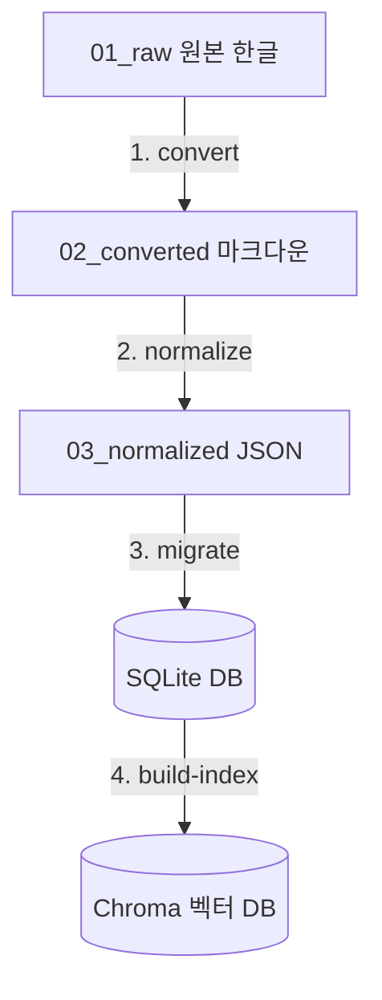
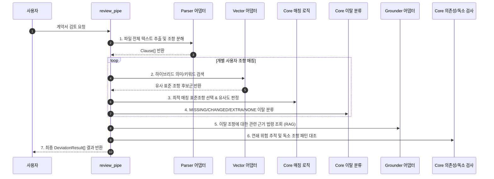

# 🛠️ src/pipe/ — 파이프라인 (데이터 준비 및 검토 흐름)

이 폴더는 WorkShield 시스템에서 각각의 구성 요소들(어댑터와 코어 비즈니스 로직)을 유기적으로 이어 붙여, **하나의 완성된 흐름(파이프라인)으로 조립**하는 공간입니다.

파일명의 숫자는 원칙적으로 데이터 처리 및 실행의 순서를 의미합니다.

> **💡 실행 유의사항**
> 파일명이 `0.migrate.py`와 같이 숫자로 시작하는 스크립트들은 파이썬 표준 규격상 `import` 문으로 직접 불러올 수 없습니다. 따라서 다른 스크립트에서 가져다 쓰는 '모듈'이 아닌, **독립적인 실행 스크립트**로 취급합니다 (`uv run python src/pipe/...` 또는 `just` 단축 명령으로 실행).

---

## 🗄️ 오프라인 파트: 표준 코퍼스 빌드 파이프라인
> **실행 시점:** 새로운 표준 계약서 양식이 추가되거나, 기존 정답 데이터(seed)가 수정되었을 때 실행하여 데이터베이스와 AI 색인을 최신화합니다.
> **데이터 흐름:** `01_raw (원본 HWP)` ➔ `02_converted (마크다운)` ➔ `03_normalized (JSON)` ➔ `SQLite DB` ➔ `Chroma 벡터 DB`

### 1단계: 마크다운 텍스트 변환 (`1.convert.py` 역할)
*   **어떻게 진행되나요:** `data/01_raw/` 폴더의 가공되지 않은 한글 계약서(.hwp)를 읽어와, kordoc 엔진을 사용하여 표(Table) 구조와 서식을 완벽히 유지한 마크다운(.md) 문서로 변환한 후 `data/02_converted/`에 파일로 내보냅니다.
*   **실행 명령:** `just parse <파일경로>`

### 2단계: 조항 단위 분해 및 카테고리 라벨링 (`normalize.py` 역할)
*   **어떻게 진행되나요:** 변환된 마크다운 텍스트를 읽어 '제N조(제목)' 형태의 헤더를 기준으로 개별 조항들을 칼로 자르듯 분해합니다. 그 후 각 조항의 제목과 본문에 포함된 핵심 키워드를 판별하여 표준 카테고리(예: `IP_OWNERSHIP`, `PAYMENT` 등)를 부여한 뒤, `data/03_normalized/` 폴더에 구조화된 JSON 파일로 저장합니다.
*   **실행 명령:** `just normalize`

### 3단계: RDB 스키마 마이그레이션 (`0.migrate.py` 역할)
*   **어떻게 진행되나요:** 기존 SQLite 파일(`contract.sqlite3`)을 초기화한 후, 최신 스키마 DDL(`01.CREATE_TABLE.sql`)을 적용하여 빈 테이블들을 만듭니다. 그 후 `03_normalized/`에 저장된 정규화 JSON 파일들을 로드하고 Pydantic 모델을 통해 데이터 유효성을 엄격하게 검증한 뒤 SQLite 데이터베이스로 일괄 적재합니다.
*   **실행 명령:** `just migrate` (또는 `just setup` 실행 시 자동 동작)

### 4단계: AI 벡터 색인 빌드 (`build_index.py` 역할)
*   **어떻게 진행되나요:** SQLite에 적재가 완료된 표준 조항 텍스트들을 모두 불러옵니다. 이 텍스트들을 로컬에 로드된 BGE-M3 임베딩 모델을 사용하여 1024차원의 수치형 의미 벡터로 변환한 뒤, 고속 검색이 가능하도록 Chroma 벡터 데이터베이스(`chroma_meta.sqlite3`)에 ID 및 메타데이터와 함께 저장(색인)합니다.
*   **실행 명령:** `just build-index`

> 💡 **단축키 안내:** `just build-db` 명령 한 번이면 **3단계(RDB 적재)와 4단계(AI 벡터 인덱스 빌드)가 순차적으로 연동되어 원클릭으로 가동**됩니다.

---

## 🛡️ 런타임 파트: 실시간 계약서 검토 파이프라인
> **실행 시점:** 웹 서비스 또는 MCP 클라이언트(사용자)가 특정 계약서 파일을 검토해 달라고 요청할 때마다 실시간으로 작동합니다.

### 🚀 실시간 검토 진행 단계 (`review_pipe.py` 기준)

사용자가 계약서를 업로드하면, 파이프라인이 각 어댑터와 코어 함수들을 다음과 같은 흐름으로 통제 및 가동합니다:

1.  **사용자 조항 추출 (Parser 연동):** Upload된 계약서 파일을 파싱하여 마크다운 청크로 쪼갠 뒤, '제N조' 형태의 개별 사용자 조항(`Clause`) 리스트로 뽑아냅니다.
2.  **하이브리드 검색 (Retriever 연동):** 추출된 각 사용자 조항 텍스트에 대해, Chroma 벡터 검색(의미 기반)과 BM25 형태소 검색(키워드 기반)을 병행하고 리랭커(Reranker)를 거쳐 점수를 매긴 가장 어울리는 표준 계약서 후보군들을 가져옵니다.
3.  **최적 매칭 선별 (Matching 코어):** 후보군들 중 매칭 임계치(기본 `0.5`)를 만족하면서 유사도 점수가 가장 높은 최적의 표준 조항을 해당 사용자 조항의 짝궁으로 매칭합니다.
4.  **이탈 분류 및 누락 탐지 (Deviation 코어):** 매칭된 조항들의 본문 유사도를 계산하여 변경 수준에 따라 `CHANGED`, `NONE`으로 분류합니다. 매칭 조항이 전혀 없는 문구는 추가된 조항인 `EXTRA`로 판단합니다. 또한 사용자 계약서에 전혀 매칭되지 않고 남은 필수 표준 조항들은 `MISSING`(누락)으로 지정합니다. 검색 결과가 아예 없는 비표준 조항은 실패 없이 `NO_MATCH` 표식을 채워 넣습니다.
5.  **법령 근거 매핑 (Grounder 연동):** 변경(`CHANGED`)되거나 누락(`MISSING`)된 이탈 조항의 카테고리를 분석하여 법제처 표준 법령 데이터베이스에서 법적인 조문 근거(`GroundingLaw`, 예: 저작권법 제22조 등)를 찾아 함께 엮어줍니다.
6.  **위험 및 부당 패턴 추가 추적 (Graph / Toxic 코어):** 조항의 수정으로 인해 연쇄적으로 위태로워지는 타 조항들의 목록을 의존성 그래프(`clause_graph.json`)를 탐색하여 수집하고, 을에게 부당하게 강요되는 알려진 독소 조항 패턴(`toxic_patterns.json`)과 일치하는 부분이 없는지 최종 스캔하여 보고서에 함께 실어줍니다.
7.  **최종 반환:** 모든 조항 분석 결과를 깔끔하게 취합하여 `List[DeviationResult]` 형태로 호출처(MCP 서버 또는 웹 클라이언트)에 돌려줍니다.

---

## 🚀 고도화 설계 (기획서 7.1·7.2)

> **코어가 도는 것을 확인한 뒤 얹습니다.** 재료(enum·모델·`clause_relations`/`toxic_patterns` 테이블·seed·`core` 순수함수)는 이미 준비돼 있고, 여기서는 **"어디에 어떻게 끼우는지"** 만 정의합니다. 담당 카드: [E_toxic](../../docs/tasks/E_toxic.md)·[F_graph](../../docs/tasks/F_graph.md).

런타임 review 흐름의 **6단계(위험·독소 추적)** 를 두 축으로 구현합니다 — 둘 다 `DeviationResult` 를 풍부화할 뿐, 기존 1~5단계를 바꾸지 않습니다.

### 고도화 B — 독소조항 양방향 검색 (7.2)
기존이 *표준 → 사용자*(빠짐/다름)라면, 여기에 ***독소 패턴 → 사용자*** 축을 추가합니다.

- **오프라인(빌드):** `build_index` 에 **`toxic_patterns` Chroma 컬렉션** 빌드를 추가 (`toxic_patterns` 테이블 → 임베딩 → Chroma). 표준조항 컬렉션과 동일 패턴, `just build-db` 에 연결.
- **런타임(검색):** 각 사용자 조항을 `vector.search("toxic_patterns", ...)` 로도 조회 → `(ToxicPattern, score)` → `core.detect_toxic_patterns(threshold)` → **`DeviationResult.toxic_patterns`** 채움.
- **효과:** "표준엔 없지만 사용자에게 해로운 추가 조항"을 잡아 검토 축이 하나 늘어납니다.

### 고도화 A — 계약-조항 의존성 그래프 (7.1)
한 조항이 이탈하면 **연결된 조항도 함께 검토**하도록 연결을 따라갑니다.

- **구현체:** 신규 `contracts/implement/clause_graph.py` (`ClauseGraph(Graph)`). DB·core·변환을 엮는 **조합 구현**이라 `implement/` 에 둡니다.
  - `clause_relations`(**category 레벨 엣지**)를 SQLite 에서 로드 → 인접목록 구성 → `core.traverse_related_risks`(순수 DFS) 재사용.
  - `get_related_risks(clause_id)` = clause_id → category → 인접 탐색 → 연관 category → **clause_id 역매핑**.
- **런타임(결합):** 이탈 조항의 연관 조항을 **`DeviationResult.related_risk_clauses`** 에 채움.
- **데이터 표기 주의:** 그래프 엣지의 원천은 **`data/03_normalized/clause_relations.json` + `clause_relations` 테이블**입니다. (일부 문서의 `clause_graph.json` 표기는 이 파일을 가리키는 것 — `clause_relations` 가 정확)
- **(stretch) `impact_map` 조합:** korean-law-mcp 의 조문↔판례 연결을 더해 *사용자 조항 → 표준 조항 → 법령 → 판례* provenance 로 확장. 단 현재 `koreanLaw` 어댑터에 해당 기능이 없으므로 **지원 여부 확인 후, 없으면 2차로 미룸**.

> 원칙: 두 고도화 모두 **별도 외부 DB·LLM 없이** 기존 `adapter`(vector·db) + `core` 순수함수의 조립으로 1차 범위 안에서 동작합니다.

## 🚫 절대 원칙 및 규칙
*   **Git 형상관리 대상 준수:** 오프라인 데이터 가공 단계(1, 2단계)의 결과물인 `02_converted/*.md` 파일들과 정규화 데이터 파일 `03_normalized/*.json` 파일들은 **반드시 Git 커밋**으로 형상관리합니다. (SQLite 및 Chroma 바이너리 파일은 절대 커밋하지 않고 로컬에서 매번 `just build-db`로 구워 씁니다.)
*   **순수 비즈니스 로직 유지:** 런타임 조립 모듈은 비즈니스 규칙인 `core` 함수들만을 모아 조립해야 하며, 데이터베이스 입출력 등의 모든 외부 인프라 작업은 파라미터를 통해 구현체(어댑터)를 주입받아 수행하도록 설계합니다.
